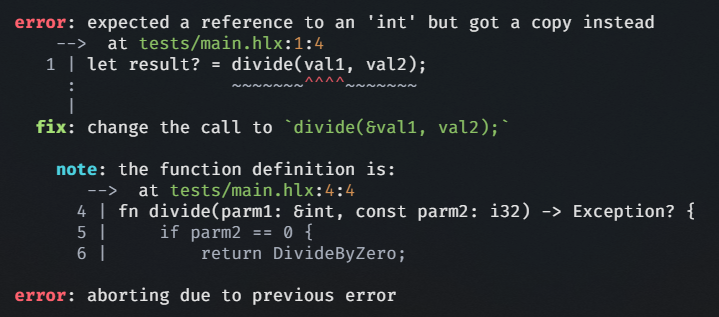

<div align="center">
  
</div>

| [Website](https://www.helix-lang.com) | [Introduction](#helix-programming-language) | [Why Helix?](#why-helix) | [Features](#features) | [Syntax Examples](#helix-syntax-examples) | [Quick Start](#quick-start) | [Goals](#goals) | [Community and Contributing](#community-and-contributing) | [License](#license) | [Acknowledgements](#acknowledgements) | [Links](#links) |

# Helix Programming Language: A Modern, High-Performance Language combining Rust, Python, and C++

## Why Helix?
Helix is designed to address several limitations found in other modern languages like Rust and Zig:

---

<div>
  
</div>

### Key Goals of Helix:
- **High-performance**: Designed to match or surpass the speed of C.
- **Safety**:           Focused on safe memory management without sacrificing developer productivity and freedom.
- **Robustness**:       Provides tools and features that ensure code stability and reduce runtime errors.

### Design Philosophy:
- **Modern syntax**:    Inspired by Rust, but simpler, and understandable for anyone.
- **General-purpose**:  Suitable for a wide range of applications, from systems programming to game development and artificial intelligence.
- **Ease of use**:      Balances power with usability, making it friendly for both beginners and experienced developers.

### Key Features:
- **Performance-centric**:  Designed to compete with C in terms of performance.
- **Expressive syntax**:    Combines Python's simplicity with Rust's modern constructs and C++'s power.
- **Type safety**:          Strong type system, but with the flexibility of python type annotations.
- **Concurrency**:          Built-in support for concurrency to take advantage of modern multicore architectures.

### Memory Safety in Helix:
- **Borrow checker**:   Ensures safe memory management, similar to Rust's model.
- **Non-blocking**:     Unlike stricter models, Helix treats **invalid borrows and ownership violations** as **warnings** rather than errors, allowing the program to compile and run.
- **Reference-counted pointers**:   When an invalid borrow is detected, Helix automatically switches to a reference-counted pointer, maintaining functionality but potentially introducing a **performance hit**.
- **Performance-conscious**:        Developers are informed through warnings about possible performance penalties, allowing them to decide when to optimize without being impeded by rigid safety rules. while still maintaining a high level of memory safety.

### Applications:
- **Systems programming**:  Designed to work efficiently at the low level, close to hardware, while giving developers the freedom.
- **Game development**:     Provides the tools necessary for fast, real-time performance in complex applications.
- **AI development**:       Efficient enough for resource-intensive tasks like machine learning and artificial intelligence.

## Syntax Examples

### Error Reporting
Helix provides detailed and informative error messages to help with debugging:

<div align="left">
  <a href="#">
  
</a></div>

### Strong Typing with Flexible Generics
Helix allows for flexible typing with robust generic systems:

<div align="left">
  <a href="#">
  
</a></div>


### Asynchronous Programming
Helix supports asynchronous code with `async` and `await`:

<div align="left">
  <a href="#">
  
</a></div>

---

## Why Not Rust or Zig?

While both Rust and Zig are excellent languages, they come with certain trade-offs that Helix seeks to address:
- **Lack of OOP Support:** Both Rust and Zig lack comprehensive OOP support, which is essential for certain domains like AI or game development.
- **Strict Safety Mechanisms (Rust):** While Rust's borrow checker is a powerful tool, it can sometimes be too strict, leading to complex refactoring for developers.
- **Limited Features (Zig):** Zig, while performant, lacks certain features like a macro processor that Helix provides.

### Helix: The Best of Both Worlds

Helix draws inspiration from Rust, Python, and C++, combining the strengths of these languages while addressing their weaknesses:
- **Balanced Safety:** Helix features a borrow checker, but with a less strict enforcement, offering flexibility without sacrificing safety.
- **Simpler Syntax:** Helix provides a modern, Python-like syntax, reducing verbosity while maintaining power.
- **OOP Support:** Helix fully supports object-oriented programming, making it suitable for a wide range of applications.

---

### Quick Start

#### Installation & Build

> [!WARNING]
> Helix is currently under development and does not yet have a useable compiler. The following instructions are for development and building the compiler itself.

> [!TIP]
> Linux is not *yet* tested, Most development is done on MacOS or Windows, if any issues arise with building on Linux, please open an issue.

### Prerequisites

- **Xmake**: [Install Xmake](https://xmake.io/#/)
- **Python**: [Install Python](https://www.python.org/downloads/)
- **Git**: [Install Git](https://git-scm.com/downloads)
- **C++ Compiler**: Ensure you have a C++ compiler (e.g., **Clang**, **MSVC**, or **GCC**).

##### Windows Specific (Visual Studio Build Tools)

> [!CAUTION]
> Only **msvc** is supported and tested on Windows, **gcc** is not supported on Windows. and **mingw** is not tested.

1. Install [Visual Studio Build Tools](https://visualstudio.microsoft.com/visual-cpp-build-tools/) and select the following components:
   - **Desktop development with C++** (workload)
   - **MSVC v143** or higher
   - **Windows SDK**
   - **C++ CMake tools for Windows**
   - **C++ Clang Tools for Windows v17.0.x** or higher
   - **C++ ATL for v143 build tools** or higher
  
2. Install [Python](https://www.python.org/downloads/)

3. Install [xmake](https://xmake.io/#/) (PowerShell Only)
```powershell
$ Invoke-Expression (Invoke-Webrequest 'https://xmake.io/psget.text' -UseBasicParsing).Content
```

##### MacOS, Unix or Linux Specific (clang or gcc)

> [!WARNING]
> **Perl** is required for building on Linux, if you don't have it installed, install using your package manager.

1. Install [Python](https://www.python.org/downloads/)
   
2. Install Xmake (bash or zsh):
```ps
curl -fsSL https://xmake.io/shget.text | bash
```

3. Install necessary build tools such as Clang or GCC. (should be installed by default on MacOS)

##### All Platforms (After following platform specific steps)

1. Make a directory for the project and clone the repo
```ps
$ git clone https://github.com/kneorain/helix-lang.git
$ cd helix-lang
```

2. Build Helix along with the LLVM backend, Clang, Tests, and the Helix Compiler Toolchain API (~30 minutes on a 8-core CPU)
```ps
$ xmake build
```

3. Run the tests or the compiler
```ps
$ xmake run tests
$ xmake run helix -h
```

--------------------------------------------------------------------------------

### Hello, World!

Here's how you can write and run a simple "Hello, World!" program in Helix:

```rust
// hello_world.hlx
print("Hello, World!");
```

To compile then run the source:

```ps
$ ./build/.../bin/helix hello_world.hlx
or
$ helix hello_world.hlx
$ ./hello_world
```

---

## Project Status and Roadmap

Helix is currently in the early stages of development, currently focusing on the toolchain and compiler. The project is under active development, and we are working hard to bring you a 0.0.1 release soon.

### Checklist for the 0.0.1 release:
#### Compiler
- [x] Lexer
- [ ] Preprocessor
- [ ] AST Parser
- [ ] CST Parser
- [ ] Semantic Analyzer
- [ ] Code Generator
- [ ] Optimizer
- [ ] Linker
- [ ] Compiler API
- [ ] Compiler CLI
- [ ] Compiler Tests
- [ ] Compiler Documentation

#### Standard Library


---

## Community and Contributing

Helix is an open-source project, and we welcome contributions! Whether it's fixing bugs, improving documentation, or adding new features, your contributions are valuable.

- [Submit Issues](https://github.com/kneorain/helix-lang/issues)
- [Submit Pull Requests](https://github.com/kneorain/helix-lang/pulls)

Read our [Contributing Guide](CONTRIBUTING.md) for more details.

---

## License

Helix is licensed under the Attribution 4.0 International License. See the [LICENSE](https://github.com/kneorain/helix-lang/blob/main/license) for more details.

---

## Acknowledgements

We want to thank all contributors for their efforts in making Helix a reality. Your work is appreciated!

<div align="center">
  <a href="https://github.com/kneorain/helix-lang/graphs/contributors">
    
  </a>
</div>

---

Happy coding with Helix! 🚀

---

## Links

- [Official Website](https://helix-lang.com)
- [Documentation](https://helix-lang.com/docs)
- [Tutorials](https://helix-lang.com/tutorials)
