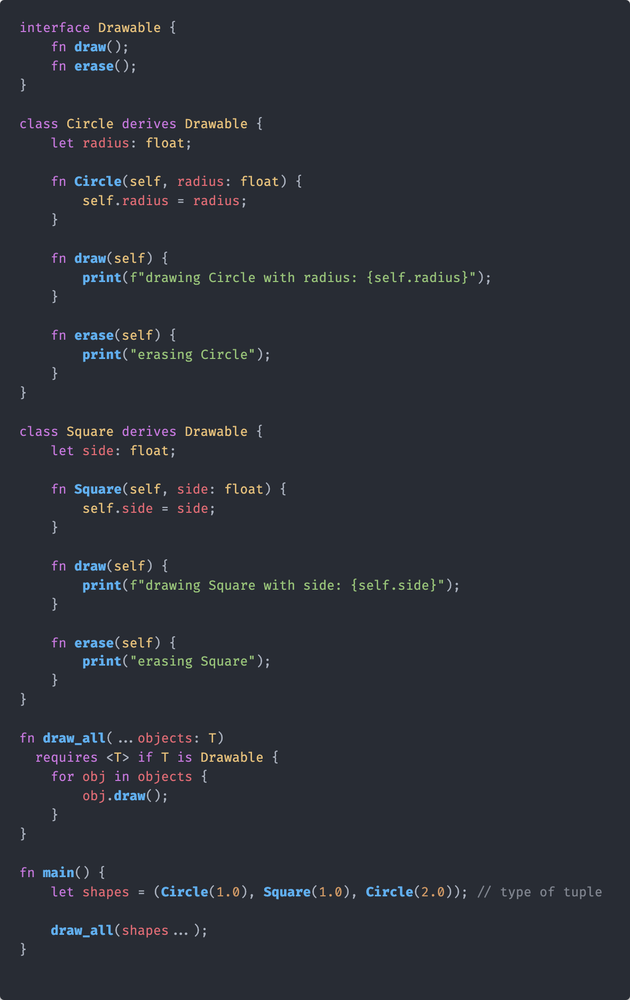
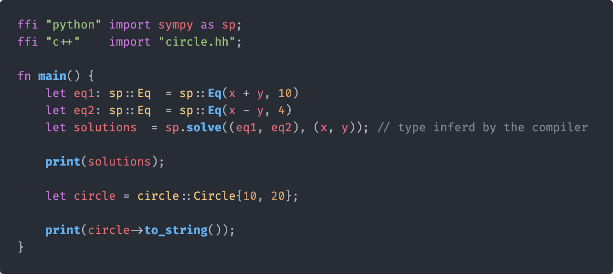

<div align="center">
  
</div>

| [Website](https://www.helix-lang.com) | [Introduction](#helix-programming-language) | [Why Helix?](#why-helix) | [Getting Started](#getting-started-with-helix) | [Goals](#goals) | [Community](#community-and-contributing) | [License](#license) |

# Helix Programming Language

Helix is an experimental language designed for seamless interoperability with Python, C, C++, and Rust. The project aims to provide developers with a fast, efficient, and easy-to-use language that can leverage the power of existing code and libraries in these languages. With its clean syntax and robust features, Helix aims to simplify the process of writing and maintaining code while maximizing performance.

--------------------------------------------------------------------------------

<div>
  
</div>

## Why Helix?

- **Performance**: Optimized for speed and efficiency, making it ideal for critical applications and systems programming.
- **Interoperability**: Seamlessly integrates with C++, Rust, and Python, allowing you to leverage existing codebases.
- **Productivity**: Advanced tooling, including a robust standard library, package manager, and build system.
- **Safety**: Strong type system and error handling to catch bugs at compile-time and runtime.

## Features

- **Concurrent Programming**: Easy-to-use async/await syntax for concurrent tasks.
- **Pattern Matching**: Powerful pattern matching for more readable and maintainable code.
- **Macros and -Processors**: Extensible macros and -processors for code generation and optimization.
- **Rich Standard Library**: Extensive libraries to handle various programming tasks out of the box.
- **Object-Oriented Programming**: Support for classes and objects, enabling encapsulation, inheritance, and polymorphism for modular and reusable code.

## Why Not Use Rust or Zig?

At Helix, we believe there's a gap in the programming language space that neither Rust nor Zig fully addresses. While both languages have their strengths, they also have limitations that we aim to overcome with Helix.

### Limitations of Both Rust and Zig

- **Lack of OOP Support**: Both Rust and Zig lack comhensive object-oriented programming (OOP) support. This can make certain types of applications, like AI development and game development, more cumbersome to implement.
- **Complex Syntax**: Both languages have syntaxes that can be verbose and complex, increasing the learning curve and potentially slowing down development.

### Specific Limitations of Rust

- **Strict Safety Mechanisms**: Rust’s borrow checker is often too strict, making it difficult for developers to write complex programs without extensive refactoring.
- **Verbosity**: The syntax of Rust can be cumbersome and verbose, which can slow down development and increase the learning curve.

### Specific Limitations of Zig

- **Limited Features**: While Zig is simple and performant, it lacks features like a processor, which can limit its flexibility and control over the code compilation process.
- **Less Focus on Safety**: Zig does not emphasize safety to the same extent as Rust, which can lead to potential issues in memory management and concurrency.

### Advantages of Helix

Helix draws inspiration from the best parts of Rust, Python, Zig, and other modern languages, combining their strengths while addressing their weaknesses.

- **Balanced Safety**: Helix includes a borrow checker for pointers and references, but it's less strict. Code that fails the borrow checker emits a severe warning instead of an error, allowing developers to proceed while being aware of potential issues.
- **Simpler Syntax**: Helix offers a syntax that is both modern and easy to use, inspired by Python’s simplicity. Variable/Paramater types are strict but flexiable, resembling Python’s syntax, making it more accessible to a broader range of developers.
- **OOP Support**: Unlike Rust, Zig, and Mojo, Helix supports OOP, which is crucial for certain domains like AI development and game development. This allows for more intuitive code organization and reuse through classes and inheritance.
- **processor**: Helix includes a processor, providing additional flexibility and control over code compilation.

Helix aims to offer the right balance between safety, simplicity, and flexibility, while also trying to be a better cross paltfrom C++, unlike Zig and Rust which both try to be a better C.

Helix aims to extract the cleanest and best parts of C++ without the bloat and unreadablity of it, as said by Bjarne Stroustrup, "Within C++, there is a much smaller and cleaner language struggling to get out". Helix aims to be the smaller and cleaner langauge thats getting out.

## Helix Syntax Examples

### Unique Type System

Helix supports strong typing and flexible typing (like python) with a unique type bounding generic system:

<div align="left">
  <a href="#">
  
</a></div>

### Native Interoperability

Helix has native interop with (python, rust, c and c++) out of the box, with many more in the works by the community:

<div align="left">
  <a href="#">
  
</a></div>

### Async Programming

Handle asynchronous tasks easily with `async` and `await`:

<div align="left">
  <a href="#">
  
</a></div>

--------------------------------------------------------------------------------

### Quick Start

#### Installation & Build

> [!WARNING] Helix is currently under development and does not yet have a useable compiler. The following instructions are for development and building the compiler itself.

> [!NOTE] Linux is not tested, Most development is done on MacOS or Windows, if any issues arise with building on Linux, please open an issue.

##### Prerequisites

- [xmake](https://xmake.io/#/)
- [python](https://www.python.org/downloads/)
- [git](https://git-scm.com/downloads)
- [perl](https://www.perl.org/get.html) - Linux Only
- C++ Compiler and STL (**clang**, **msvc** or **gcc**) - Only **msvc** for Windows

##### Windows (Visual Studio Build Tools)

> [!WARNING] Only **msvc** is supported on Windows, **gcc** is not supported on Windows. and **clang** without Visual Studio Build Tools is not supported.

1. Install [Visual Studio Build Tools](https://visualstudio.microsoft.com/visual-cpp-build-tools/)
2. Make sure to install the **Desktop Development with C++** workload, with the **MSVC** compiler, **Windows SDK**, **C++ CMake Tools for Windows**, **C++ Clang Tools for Windows**, and **C++ ATL for Windows** components.
3. Install [Python](https://www.python.org/downloads/)
4. Install [xmake](https://xmake.io/#/) (PowerShell Only)

  ```powershell
  $ Invoke-Expression (Invoke-Webrequest 'https://xmake.io/psget.text' -UseBasicParsing).Content
  ```

4. Make a directory for the project and clone the repo
  ```sh
  $ git clone https://github.com/kneorain/helix-lang.git
  $ cd helix-lang
  ```

5. Build Helix along with the LLVM backend, Clang, Tests, and the Helix Compiler Toolchain API (~30 minutes)
  ```sh
  $ xmake build
  ```

6. Run the tests or the compiler
  ```sh
  $ xmake run tests
  $ xmake run helix -h
  ```

##### MacOS, Unix or Linux (clang or gcc)

> [!NOTE] **Perl** is required for building on Linux, if you don't have it installed, install using your package manager.


--------------------------------------------------------------------------------

### Hello, World!

Here's how you can write and run a simple "Hello, World!" program in Helix:

```rust
fn main() {
    print("Hello, World!");
}
```

To compile then run the source:

```bash
helix hello_world.hlx
./hello_world
```

## Goals

The Helix project aims to achieve the following goals:

- **Interoperability**: Helix will provide seamless interoperability with Python, C, C++, and Rust, allowing developers to integrate code from these languages with ease.
- **Performance**: The language will prioritize speed and efficiency, enabling developers to write fast and efficient code without sacrificing simplicity.
- **Simplicity**: Helix will feature a clean and intuitive syntax, making it easy for developers to write and understand code.
- **Rich Feature Set**: The language will offer a rich set of features including variables, functions, control flow, data types, classes, and more, providing developers with the tools they need to write powerful code.
- **Documentation**: Helix will provide comprehensive documentation to help developers learn the language and make the most of its features.
- **Testing and Benchmarking**: The project will include robust testing and benchmarking tools to ensure the reliability and performance of the language.
- **Community Involvement**: The Helix project will encourage community involvement, welcoming contributions, feedback, and collaboration to help improve the language.
- **Standard Library**: Helix will include a standard library with a wide range of functions and modules to support common programming tasks.
- **Package Manager**: The language will feature a package manager to help developers discover, install, and manage third-party libraries and tools.
- **Debugging and Profiling**: Helix will provide tools for debugging and profiling code to help developers identify and fix issues and optimize performance.
- **Memory Management**: The language will include memory management features to help developers manage memory efficiently and avoid memory leaks and other issues.
- **Concurrency**: Helix will support concurrency to enable developers to write efficient, parallel code for multi-core and distributed systems.
- **Error Handling**: The language will provide robust error handling features to help developers write reliable and resilient code.

## Community and Contributing

Helix is an open-source project and we welcome contributions from the community. Whether you're fixing a bug, improving the documentation, or adding a new feature, we'd love to have your help!

- [Submit issues](https://github.com/kneorain/helix-lang/issues) and [pull requests](https://github.com/kneorain/helix-lang/pulls) on GitHub.
- Read our [Contributing Guide](CONTRIBUTING.md) to get started.

## License

Helix is released under the Attribution 4.0 International License. See the [LICENSE](https://github.com/kneorain/helix-lang/blob/main/license) file for details.

## Acknowledgements

The Helix project is made possible by the hard work and dedication of our contributors. Thank you to everyone who are helping make Helix a reality!

<div align="center">
  <a href="https://github.com/kneorain/helix-lang/graphs/contributors">
  
</a>
</div>

--------------------------------------------------------------------------------

Happy coding with Helix! 🚀

--------------------------------------------------------------------------------

### Links

- [Official Website](https://helix-lang.com)
- [Documentation](https://helix-lang.com/docs)
- [Tutorials](https://helix-lang.com/tutorials)
