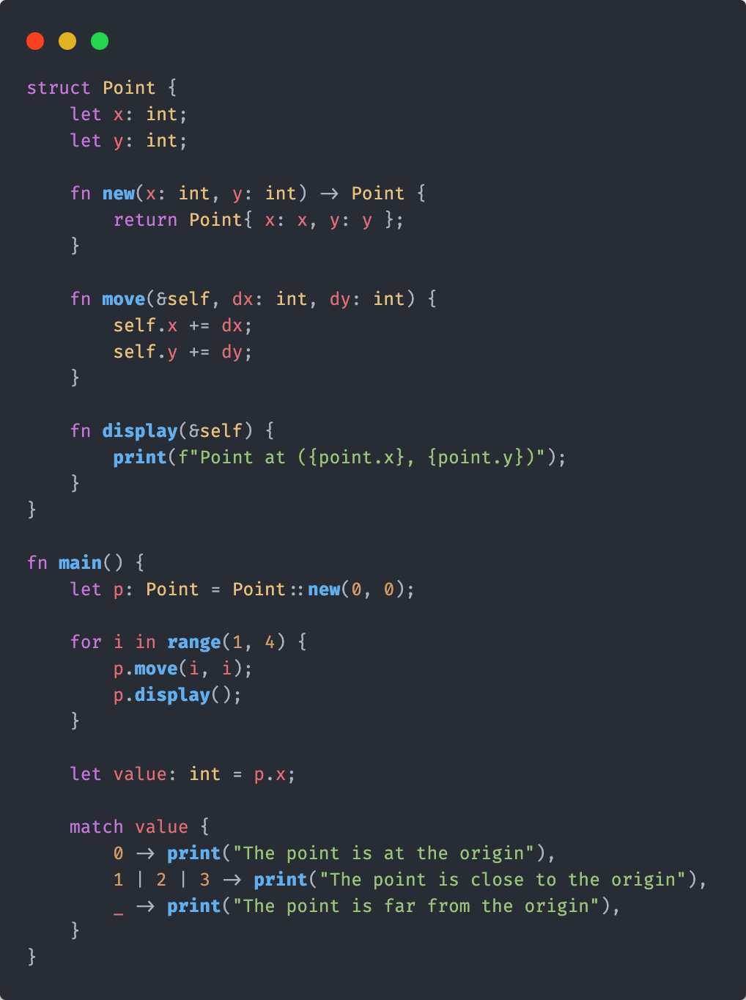
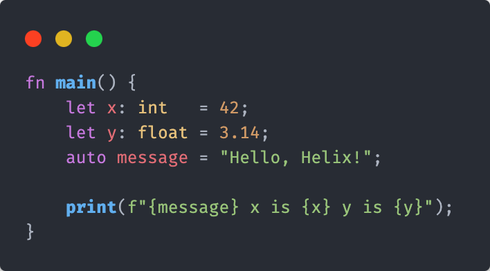
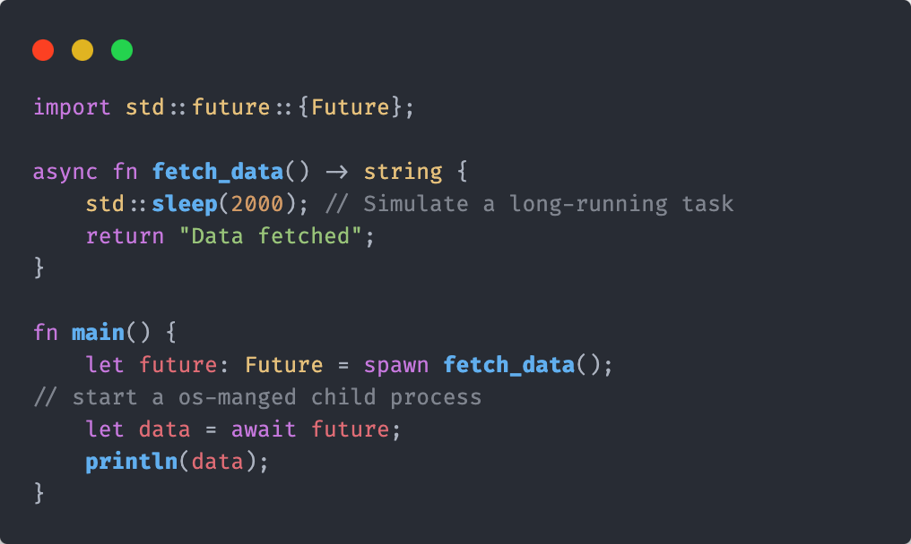

<div align="center">
  
</div>

<p align="center">
  | <a href="#helix-programming-language">Introduction</a> |
    <a href="#why-helix">Why Helix?</a> |
    <a href="#getting-started-with-helix">Getting Started</a> |
    <a href="#goals">Goals</a> |
    <a href="#community-and-contributing">Community</a> |
    <a href="#license">License</a> |
</p>

# Helix Programming Language

Helix is an experimental language designed for seamless interoperability with Python, C, C++, and Rust. The project aims to provide developers with a fast, efficient, and easy-to-use language that can leverage the power of existing code and libraries in these languages. With its clean syntax and robust features, Helix aims to simplify the process of writing and maintaining code while maximizing performance.

----

<div>

</a>
</div>

### Why Helix?

- **Performance**: Optimized for speed and efficiency, making it ideal for critical applications and systems programming.
- **Interoperability**: Seamlessly integrates with C++, Rust, and Python, allowing you to leverage existing codebases.
- **Productivity**: Advanced tooling, including a robust standard library, package manager, and build system.
- **Safety**: Strong type system and error handling to catch bugs at compile-time and runtime.

### Features

- **Concurrent Programming**: Easy-to-use async/await syntax for concurrent tasks.
- **Pattern Matching**: Powerful pattern matching for more readable and maintainable code.
- **Macros and Pre-Processors**: Extensible macros and pre-processors for code generation and optimization.
- **Rich Standard Library**: Extensive libraries to handle various programming tasks out of the box.

---

### Quick Start

#### Installation & Build

> [!WARNING]
> Helix is currently under development and does not yet have a useable compiler. The following instructions are for development and building the compiler itself.

> [!NOTE]
> Linux is not tested, Most development is done on MacOS, if any issues arise with building on Windows or Linux, please open an issue.

##### Prerequisites
- [xmake](https://xmake.io/#/)
- [python](https://www.python.org/downloads/)
- git
- C++ Compiler and STL (**clang**, **msvc** or **gcc**)

##### Windows
1. Clone the repo
    ```sh
    $ git clone https://github.com/kneorain/helix-lang.git
    $ cd helix-lang
    ```
2. Build
    ```sh
    $ xmake build helix
    ```
3. Run
    ```sh
    $ xmake run helix
    ```

##### MacOS, Unix or Linux
1. if you don't have python or xmake installed, install using [Homebrew](https://brew.sh/)
    ```sh
    $ brew install xmake python
    ```
2. Clone the repo
    ```sh
    $ git clone https://github.com/kneorain/helix-lang.git
    $ cd helix-lang
    ```
3. Build
    ```sh
    $ xmake build helix
    ```
4. Run
    ```sh
    $ xmake run helix
    ```

---

### Hello, World!

Here's how you can write and run a simple "Hello, World!" program in Helix:

```rs
fn main() {
    print("Hello, World!");
}
```

To compile then run the source:

```bash
helix hello_world.hlx
./hello_world
```

## Getting Started with Helix
##### Variables and Types
Helix supports strong typing and flexible variable declarations:
<div align="left">
  
  <a href="#"></a>
</div>

##### Control Flow
Helix provides familiar control flow constructs like `if`, `while`, and `for`:
<div align="left">
  
  <a href="#"></a>
</div>

##### Async Programming
Handle asynchronous tasks easily with `async` and `await`:
<div align="left">
  
  <a href="#"></a>
</div>

##### Functions and Classes
Define functions and classes along with other data structures with clear and concise syntax:
<div align="left">
  
  <a href="#"></a>
</div>

## Goals
The Helix project aims to achieve the following goals:

- **Interoperability**: Helix will provide seamless interoperability with Python, C, C++, and Rust, allowing developers to integrate code from these languages with ease.
- **Performance**: The language will prioritize speed and efficiency, enabling developers to write fast and efficient code without sacrificing simplicity.
- **Simplicity**: Helix will feature a clean and intuitive syntax, making it easy for developers to write and understand code.
- **Rich Feature Set**: The language will offer a rich set of features including variables, functions, control flow, data types, classes, and more, providing developers with the tools they need to write powerful code.
- **Documentation**: Helix will provide comprehensive documentation to help developers learn the language and make the most of its features.
- **Testing and Benchmarking**: The project will include robust testing and benchmarking tools to ensure the reliability and performance of the language.
- **Community Involvement**: The Helix project will encourage community involvement, welcoming contributions, feedback, and collaboration to help improve the language.
- **Standard Library**: Helix will include a standard library with a wide range of functions and modules to support common programming tasks.
- **Package Manager**: The language will feature a package manager to help developers discover, install, and manage third-party libraries and tools.
- **Debugging and Profiling**: Helix will provide tools for debugging and profiling code to help developers identify and fix issues and optimize performance.
- **Memory Management**: The language will include memory management features to help developers manage memory efficiently and avoid memory leaks and other issues.
- **Concurrency**: Helix will support concurrency to enable developers to write efficient, parallel code for multi-core and distributed systems.
- **Error Handling**: The language will provide robust error handling features to help developers write reliable and resilient code.

## Community and Contributing
Helix is an open-source project and we welcome contributions from the community. Whether you're fixing a bug, improving the documentation, or adding a new feature, we'd love to have your help!

- [Submit issues](https://github.com/kneorain/helix-lang/issues) and [pull requests](https://github.com/kneorain/helix-lang/pulls) on GitHub.
- Read our [Contributing Guide](CONTRIBUTING.md) to get started.

## License
Helix is released under the Attribution 4.0 International License. See the [LICENSE](https://github.com/kneorain/helix-lang/blob/main/license) file for details.

## Acknowledgements
The Helix project is made possible by the hard work and dedication of our contributors. Thank you to everyone who are helping make Helix a reality!

<div align="center">
  <a href="https://github.com/kneorain/helix-lang/graphs/contributors">
    
  </a>
</div>

---

Happy coding with Helix! 🚀

---

### Links
- [Official Website](https://helix-lang.com)
- [Documentation](https://helix-lang.com/docs)
- [Tutorials](https://helix-lang.com/tutorials)
