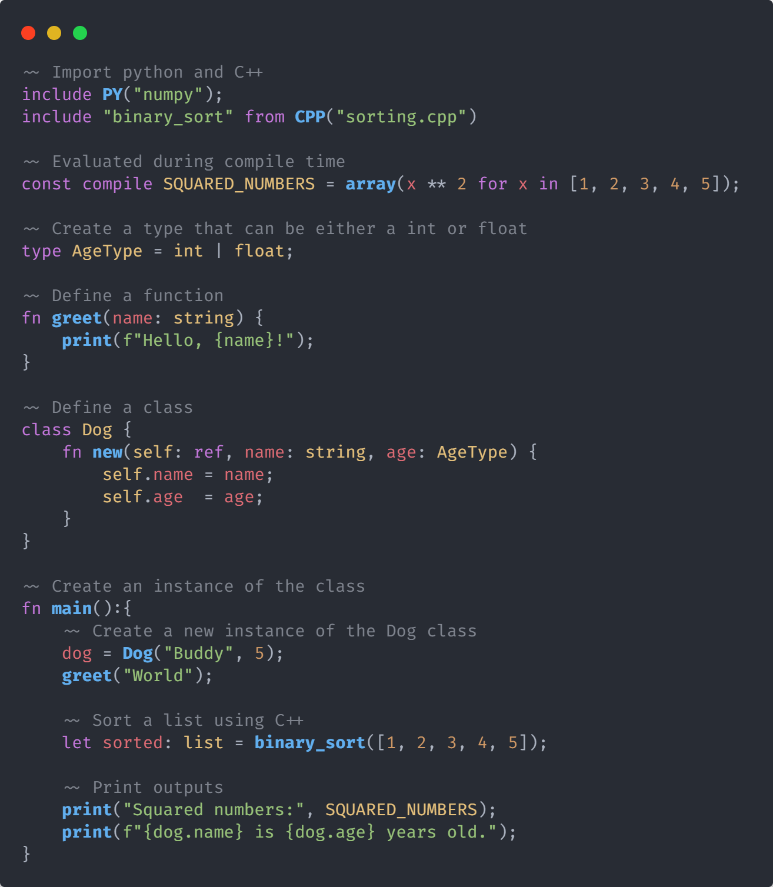
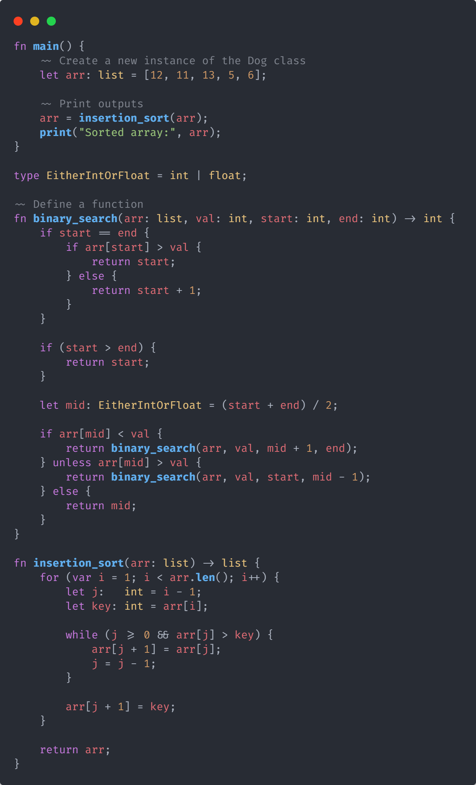

# Helix
## An experimental language to interop with Python, C, C++, and Rust
<p align="center">
  | <a href="#introduction">Why?</a> |
  <a href="#table-of-contents">Goals</a> |
  <a href="#project-status">Status</a> |
  <a href="#goals">Goals</a> |
  <a href="#getting-started">Getting started</a> |
</p>

## Introduction
Helix is an experimental language designed for seamless interoperability with Python, C, C++, and Rust. The project aims to provide developers with a fast, efficient, and easy-to-use language that can leverage the power of existing code and libraries in these languages. With its clean syntax and robust features, Helix aims to simplify the process of writing and maintaining code while maximizing performance.

---
<div>

</a>
<a href="#"></a>
</div>

**Fast and Interoperable**
-   Helix offers high performance and interoperability with Python, C, C++, and Rust, allowing developers to seamlessly integrate code from these languages.
-   Developers can leverage existing libraries and codebases while benefiting from Helix's simplicity and efficiency.
-   With a focus on speed and efficiency, Helix enables developers to write fast and efficient code with ease.

**Simple and easy to use**
-   Helix features a clean and intuitive syntax, making it easy for developers to write and understand code.
-   The language prioritizes simplicity and readability, ensuring that developers can quickly grasp its concepts and write maintainable code.

**Rich Feature Set**
-   Helix provides a rich set of features including variables, functions, control flow, data types, classes, and more.
-   Support for advanced language constructs such as generics, inheritance, and operator overloading is planned, further enhancing Helix's versatility.
-   The language aims to strike a balance between power and simplicity, offering developers the tools they need without unnecessary complexity.



</a>

## Project status
Helix is currently in the early stages of development, with a target for a working prototype by March 2024. The project encompasses various aspects, including language implementation, features, and syntax.

As of now, the project has the following structure and features:

#### Language Implementation
- [x] Lexer
- [ ] Parser
- [ ] Abstract Syntax Tree (AST)
- [ ] Error Handling
- [ ] Type Checking
- [ ] Transpiler

#### Language Features
- [x] Variables
- [x] Functions
- [x] Control Flow
- [x] Data Types
- [x] Classes
- [ ] Generics
- [ ] Inheritance
- [ ] Operator Overloading
Interop:
  - [ ] Python
  - [ ] C
  - [ ] C++
  - [ ] Rust
- [ ] Standard Library
- [ ] Package Manager
- [ ] Documentation
- [ ] Testing
- [ ] Benchmarking
- [ ] Profiling
- [ ] Debugging
- [x] Error Handling
- [ ] Memory Management
- [ ] Concurrency

#### Language Syntax
- [x] Comments
- [x] Variables
- [x] Functions
- [x] Control Flow
- [x] Data Types
- [x] Classes
- [x] Inheritance
- [x] Operator Overloading
- [x] Interop

The project is actively being developed, with ongoing work to implement remaining features and enhance existing functionality. Contributions and feedback are welcomed as we progress towards the goal of creating a powerful and versatile language.

## Goals
The Helix project aims to achieve the following goals:

- **Interoperability**: Helix will provide seamless interoperability with Python, C, C++, and Rust, allowing developers to integrate code from these languages with ease.
- **Performance**: The language will prioritize speed and efficiency, enabling developers to write fast and efficient code without sacrificing simplicity.
- **Simplicity**: Helix will feature a clean and intuitive syntax, making it easy for developers to write and understand code.
- **Rich Feature Set**: The language will offer a rich set of features including variables, functions, control flow, data types, classes, and more, providing developers with the tools they need to write powerful code.
- **Documentation**: Helix will provide comprehensive documentation to help developers learn the language and make the most of its features.
- **Testing and Benchmarking**: The project will include robust testing and benchmarking tools to ensure the reliability and performance of the language.
- **Community Involvement**: The Helix project will encourage community involvement, welcoming contributions, feedback, and collaboration to help improve the language.
- **Standard Library**: Helix will include a standard library with a wide range of functions and modules to support common programming tasks.
- **Package Manager**: The language will feature a package manager to help developers discover, install, and manage third-party libraries and tools.
- **Debugging and Profiling**: Helix will provide tools for debugging and profiling code to help developers identify and fix issues and optimize performance.
- **Memory Management**: The language will include memory management features to help developers manage memory efficiently and avoid memory leaks and other issues.
- **Concurrency**: Helix will support concurrency to enable developers to write efficient, parallel code for multi-core and distributed systems.
- **Error Handling**: The language will provide robust error handling features to help developers write reliable and resilient code.

---

# Getting started
To get started with Helix, you can follow the steps below:

1. Clone the Helix repository from GitHub:
   ```bash
   git clone https://github.com/kneorain/helix
    ```
2. Navigate to the project directory:
3. Install the required dependencies:
   ```bash
   pip install -r requirements.txt
   ```
   
> **Warning:** Helix is currently in the early stages of development and is not yet ready for production use. The project is under active development, and breaking changes may occur. We recommend using Helix for experimental purposes only and providing feedback to help improve the language.